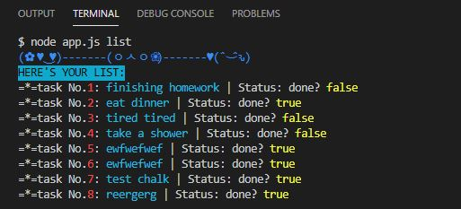

# To-do-list with Node.js


### Instruction:
All possible commands:
```
node app.js add --todo="your todo content" --status="boolean" (default is false) 
node app.js change --id="your todo id"
node app.js delete --id="your todo id"
node app.js delete-all
node app.js list (default is all)
node app.js list --status="boolean" 
```
### Example:
>
